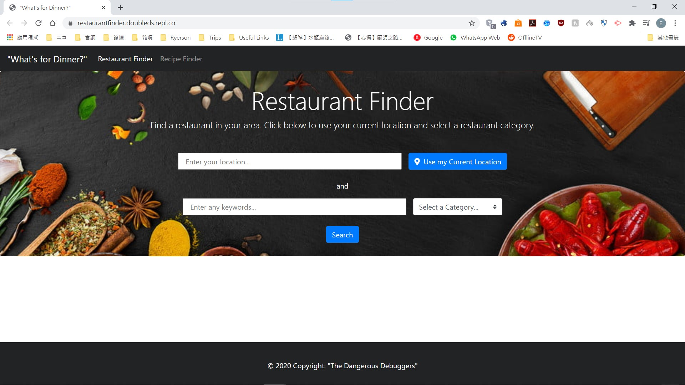

# Project1
Goal: To combine restaurant finding and recipe finding into one webapp  
This project has the following abilities:
- Makes calls to server APIs: Yelp Fusion API and EDAMAM's Recipe Search API
- Checks for user inputs and set as API parameters
- Shows results based on user inputs

 

This project consists of the following files:
- index.html: Restaurant finder page and the landing page when it is first loaded
- recipeFinder.html: Recipe finder page
- script.js: Manage API calls to Yelp Fusion API and show results for index.html/Restaurant finder page
- script2.js: Manage API calls to EDAMAM's Recipe Search API and show results for recipeFinder.html
- style.css: General styling of index.html and recipeFinder.html

 

This project is made using **HTML5**, **CSS**, **Javascript**, **jQuery**, **Bootstrap**, **Yelp Fusion API** and **EDAMAM's Recipe Search API**  
This project is currently hosted on Github Pages: https://elwinung0120.github.io/Project1/ 

## script.js and script2.js
- Send API calls to Yelp Fusion API/EDAMAM's Recipe Search API
- Insert contents for results using response from the APIs
- Check for user inputs and insert as API parameters if not blank

## index.html

## recipeFinder.html

## Future Developments
- Add ability to search for multiple dietary restrictions, include others with access to full API
- UI - would eliminate whitespace
- Custom photography or high quality stock images, sized more proportionally inside cards
- More details in recipe window
- More results shown, load as you scroll
- Display current location when on click "Use my Current Location"
- More features - Patio Availability (important during a pandemic), links to order takeout & delivery through 3rd party service
- Add Maps API - directions to restaurant
- Add Meal Kits as a third option
